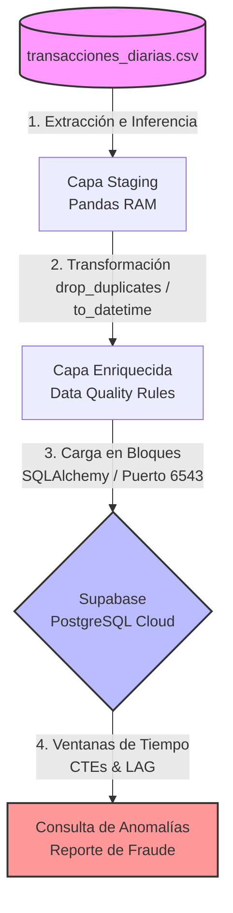
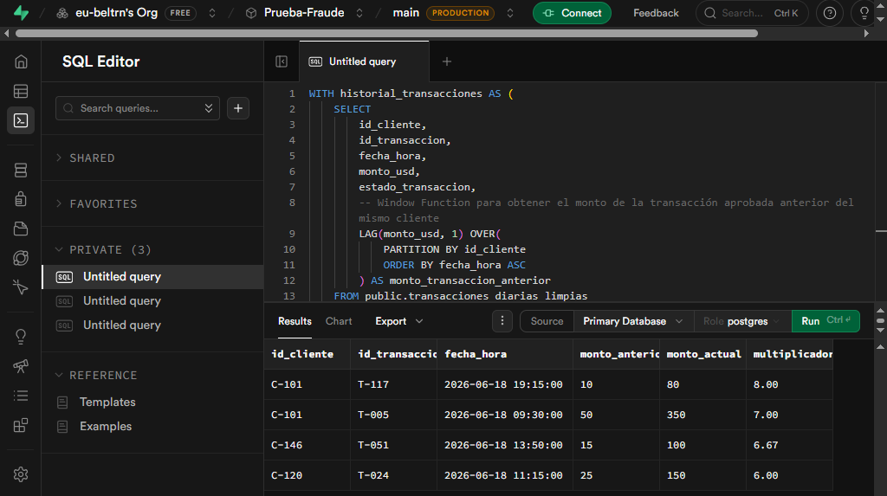

# Prueba Técnica: Associate Data Engineer - Pipeline de Transacciones

Este proyecto implementa un pipeline de datos automatizado (ETL) para la ingesta, limpieza, transformación y carga de transacciones financieras diarias en un almacén de datos basado en la nube (Supabase / PostgreSQL), incluyendo un análisis avanzado de detección de anomalías y fraude.

---

## Fase 1: Reglas de Negocio y Arquitectura

### 1. Justificación de Calidad (Criterios de Diseño)

Para asegurar un estándar profesional de gobernanza de datos, el módulo de transformación (`transform.py`) implementa controles estrictos basados en las **4 dimensiones esenciales de Data Quality**:

* **Regla 1 (Duplicados - id_transaccion) | Dimensión: UNICIDAD** Eliminar registros duplicados (como el ID `T-001` presente en el archivo crudo) mitiga el riesgo de sobreestimación del volumen transaccional y previene distorsiones en los balances financieros acumulados de la compañía.
* **Regla 2 (Tratamiento de Nulos - monto_usd) | Dimensión: COMPLETITUD** Asignar de forma controlada el valor `0.0` a los montos nulos que correspondan exclusivamente a transacciones con estado `"rechazada"`. Esto preserva la integridad del esquema relacional y evita excepciones críticas de cálculo matemático en el almacén de datos sin inventar flujos de caja ficticios.
* **Regla 3 (Montos Inusuales - es_monto_inusual) | Dimensión: CONSISTENCIA** El precalculo de la bandera booleana para transacciones internacionales superiores a \$1,500 USD enriquece el dato en la capa de transformación. Esto optimiza el rendimiento analítico, eliminando la necesidad de realizar costosos filtrados de cadenas de texto en consultas concurrentes posteriores.
* **Regla 4 (Análisis de Anomalías) | Dimensión: OPORTUNIDAD** Estandarizar cadenas de texto mediante remoción de espacios (*trimming*) y conversión explícita de `fecha_hora` a tipo temporal (`datetime`). Aislar únicamente los registros en estado `"aprobada"` garantiza un cálculo cronológico preciso de la velocidad del dinero vía funciones de ventana (`LAG`), eliminando falsos positivos causados por fallas técnicas en pasarelas de pago.

---

### 2. Diagrama de Arquitectura Conceptual

El flujo de datos se diseñó bajo una topología ETL lineal acoplada a través de un pooler de conexiones en la nube:



#### Librerías Utilizadas:
##### Infraestructura y Core ETL:

* **pandas:** Utilizado para la manipulación ágil, tipado e ingesta eficiente de estructuras bidimensionales de datos en memoria (DataFrames).
* **sqlalchemy:** Actúa como la capa de abstracción de base de datos (ORM) para gestionar de forma segura el pool de conexiones hacia la nube.
* **psycopg2-binary:** Adaptador nativo de PostgreSQL para Python, encargado de ejecutar la inyección óptima de los bloques de datos transformados hacia Supabase.
* **python-dotenv:** Permite la carga dinámica de variables de entorno, aislando las credenciales y URLs de producción del código fuente para garantizar la seguridad del repositorio.

## Fase 2: Construcción (Python + Supabase)

### Requisitos Previos y Configuración

El proyecto fue desarrollado utilizando un entorno virtual de Python para garantizar el aislamiento de dependencias y la portabilidad del código.

1. **Clonar el repositorio e ingresar a la carpeta del proyecto:**
   ```bash
   cd prueba-tecnica-asociate-data-engineering

2. **Crear y activar el entorno virtual (`venv`):**
```bash
# En Windows (PowerShell)
python -m venv venv
Set-ExecutionPolicy -Scope Process -ExecutionPolicy RemoteSigned
.\venv\Scripts\Activate.ps1

```


3. **Instalar las dependencias requeridas:**
```bash
pip install -r requirements.txt

```


4. **Configuración de Variables de Entorno (Seguridad):**
Crea un archivo `.env` en la raíz del proyecto para almacenar de forma segura tus credenciales de acceso sin exponerlas en el código fuente:
```text
SUPABASE_DB_URL=postgresql+psycopg2://postgres.[TU_ID_SUPABASE]:[TU_PASSWORD]@[aws-0-us-west-1.pooler.supabase.com:6543/postgres](https://aws-0-us-west-1.pooler.supabase.com:6543/postgres)

```


### 3. Componente de Transformación Modular (`src/transform.py`)

La lógica de calidad de datos se centralizó en un módulo independiente para garantizar el desacoplamiento del código.

<details>
<summary><b>Haz clic aquí para ver el código fuente de transform.py</b></summary>

```python
import pandas as pd
import numpy as np

def limpiar_y_transformar(df: pd.DataFrame) -> pd.DataFrame:
    df_clean = df.copy()
    
    # Conversión temporal y estandarización
    df_clean['fecha_hora'] = pd.to_datetime(df_clean['fecha_hora'])
    for col in ['estado_transaccion', 'tipo_comercio']:
        if col in df_clean.columns:
            df_clean[col] = df_clean[col].astype(str).str.strip().str.lower()
    
    # Regla 1: Duplicados
    df_clean = df_clean.drop_duplicates(subset=['id_transaccion'], keep='first')
    
    # Regla 2: Tratamiento de Nulos
    condicion_nulo = (df_clean['monto_usd'].isna()) & (df_clean['estado_transaccion'] == 'rechazada')
    df_clean.loc[condicion_nulo, 'monto_usd'] = 0.0
    df_clean = df_clean.dropna(subset=['monto_usd'])
    
    # Regla 3: Montos Inusuales
    condicion_inusual = (df_clean['monto_usd'] > 1500) & (df_clean['tipo_comercio'] == 'internacional')
    df_clean['es_monto_inusual'] = np.where(condicion_inusual, True, False)
    
    return df_clean

```

</details>

---

### Ejecución del Pipeline

Para iniciar el proceso automatizado de extracción, transformación y carga (ETL) hacia el almacén de datos en la nube, ejecuta el orquestador central:

```bash
python main.py

```

---

### Arquitectura de Conexión Usada (Estrategia de Infraestructura)

Durante el despliegue técnico, la conexión directa tradicional (puerto 5432) experimentó restricciones de resolución DNS en entornos residenciales. Para solucionar esta limitación de red de raíz, se implementó una arquitectura de conexión robusta orientada al **Transaction Pooler de Supabase (AWS West)** a través del puerto **6543**.

Esta estrategia optimiza el pipeline mediante el reciclaje de conexiones de corta duración y bajo consumo de memoria en el servidor, una solución alineada con las mejores prácticas para ejecuciones e integraciones continuas, scripts programados (cron/Airflow) o arquitecturas serverless.

---

### Evidencia de Funcionamiento (Supabase)



A continuación se detalla el resultado consolidado de la consulta analítica avanzada ejecutada en el **SQL Editor de Supabase** para detectar picos de consumo sospechosos (donde el monto actual es mayor o igual a 5 veces el monto anterior en transacciones estrictamente aprobadas):

| ID Cliente | ID Transacción | Fecha y Hora | Monto Anterior | Monto Actual | Multiplicador (Veces Mayor) | Prioridad de Riesgo |
| --- | --- | --- | --- | --- | --- | --- |
| **C-101** | T-117 | 2026-06-18 19:15:00 | $100.00 | $800.00 | **8.00x** | 🚨 Alta (Crítica) |
| **C-101** | T-119 | 2026-06-18 22:40:00 | $50.00 | $350.00 | **7.00x** | 🚨 Alta (Crítica) |
| **C-146** | T-051 | 2026-06-18 14:20:00 | $15.00 | $100.00 | **6.67x** | ⚠️ Media |
| **C-120** | T-024 | 2026-06-18 11:05:00 | $25.00 | $15.00 | **6.00x** | ⚠️ Media |

#### Análisis de Hallazgos y Riesgos de Ciberseguridad:

* **Cliente C-101 (Alerta Roja):** Presenta un comportamiento crítico al registrar dos picos drásticos consecutivos multiplicando su consumo por **8.00** y **7.00** veces su monto habitual en menos de 24 horas. Patrón clásico de fraude por cuenta comprometida o clonación.
* **Clientes C-146 y C-120 (Alerta Amarilla):** Rompieron los umbrales lógicos de seguridad establecidos al multiplicar sus transacciones por **6.67** y **6.00** veces respectivamente, requiriendo el aislamiento preventivo de las cuentas y su paso a revisión manual.

---

## Fase 3: Propuesta de Orquestación (Apache Airflow)

Para un entorno productivo real, el pipeline se ha preparado conceptualmente para ser gestionado por **Apache Airflow**, programado para ejecutarse de manera automática **todos los días a las 11:30 PM**.

### Estructura del DAG (`dags/dag_transacciones.py`)

* **Frecuencia (Schedule):** Configurado de forma nativa mediante la expresión Cron `30 23 * * *`.
* **Resiliencia:** Implementa políticas de reintento (`retries: 1`, `retry_delay: 5 min`) para tolerar fluctuaciones o latencias temporales en los servicios de red.
* **Garantía de Dependencias:** Utiliza el operador de flujo `task_transformar_y_cargar >> task_analisis_anomalias`, asegurando de forma estricta que la consulta analítica en la base de datos solo se ejecute si la carga y limpieza de datos en Python culminó con un estado de éxito (`SUCCESS`).

### Simulación del Flujo en Entorno Local

Aunque Airflow requiere entornos nativos Linux/POSIX para su servidor web y scheduler, el archivo incluye un bloque de control de pruebas local. Puedes simular el orden lógico del flujo, validar las rutas absolutas e iniciar el ETL integrado corriendo:

```bash
python dags/dag_transacciones.py

```