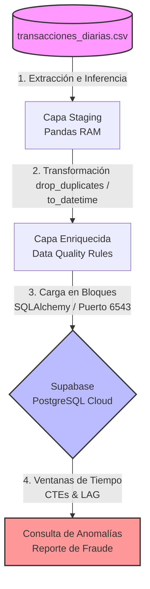

# Prueba Técnica: Associate Data Engineer - Pipeline de Transacciones

Este proyecto implementa un pipeline de datos automatizado (ETL) para la ingesta, limpieza, transformación y carga de transacciones financieras diarias en un almacén de datos basado en la nube (Supabase / PostgreSQL), incluyendo un análisis avanzado de detección de anomalías y fraude.

---

## Fase 1: Reglas de Negocio y Arquitectura

### 1. Justificación de Calidad (Criterios de Diseño)

Para asegurar un estándar profesional de gobernanza de datos, el módulo de transformación (`transform.py`) implementa controles estrictos basados en las **4 dimensiones esenciales de Data Quality**:

* **Regla 1 (Duplicados - id_transaccion) | Dimensión: UNICIDAD** Eliminar registros duplicados (como el ID `T-001` presente en el archivo crudo) mitiga el riesgo de sobreestimación del volumen transaccional y previene distorsiones en los balances financieros acumulados de la compañía.
* **Regla 2 (Tratamiento de Nulos - monto_usd) | Dimensión: COMPLETITUD** Asignar de forma controlada el valor `0.0` a los montos nulos que correspondan exclusivamente a transacciones con estado `"rechazada"`. Esto preserva la integridad del esquema relacional y evita excepciones críticas de cálculo matemático en el almacén de datos sin inventar flujos de caja ficticios.
* **Regla 3 (Montos Inusuales - es_monto_inusual) | Dimensión: CONSISTENCIA** El precalculo de la bandera booleana para transacciones internacionales superiores a \$1,500 USD enriquece el dato en la capa de transformación. Esto optimiza el rendimiento analítico, eliminando la necesidad de realizar costosos filtrados de cadenas de texto en consultas concurrentes posteriores.
* **Regla 4 (Análisis de Anomalías) | Dimensión: OPORTUNIDAD** Estandarizar cadenas de texto mediante remoción de espacios (*trimming*) y conversión explícita de `fecha_hora` a tipo temporal (`datetime`). Aislar únicamente los registros en estado `"aprobada"` garantiza un cálculo cronológico preciso de la velocidad del dinero vía funciones de ventana (`LAG`), eliminando falsos positivos causados por fallas técnicas en pasarelas de pago.

---

### 2. Diagrama de Arquitectura Conceptual

El flujo de datos se diseñó bajo una topología ETL lineal acoplada a través de un pooler de conexiones en la nube:



#### Librerías Utilizadas:
##### Infraestructura y Core ETL:

* **pandas:** Utilizado para la manipulación ágil, tipado e ingesta eficiente de estructuras bidimensionales de datos en memoria (DataFrames).
* **sqlalchemy:** Actúa como la capa de abstracción de base de datos (ORM) para gestionar de forma segura el pool de conexiones hacia la nube.
* **psycopg2-binary:** Adaptador nativo de PostgreSQL para Python, encargado de ejecutar la inyección óptima de los bloques de datos transformados hacia Supabase.
* **python-dotenv:** Permite la carga dinámica de variables de entorno, aislando las credenciales y URLs de producción del código fuente para garantizar la seguridad del repositorio.

---

## Fase 2: Construcción (Python + Supabase)

### Requisitos Previos y Configuración

El proyecto fue desarrollado utilizando un entorno virtual de Python para garantizar el aislamiento de dependencias.

1. **Clonar el repositorio e ingresar a la carpeta:**
```bash
cd prueba-tecnica-asociate-data-engineering

```


2. **Crear y activar el entorno virtual (`venv`):**
```bash
# En Windows (PowerShell)
python -m venv venv
Set-ExecutionPolicy -Scope Process -ExecutionPolicy RemoteSigned
.\venv\Scripts\Activate.ps1

```


3. **Instalar dependencias requeridas:**
```bash
pip install -r requirements.txt

```


### Ejecución del Pipeline

Para iniciar el proceso de extracción, transformación y carga automática (ETL) hacia la base de datos, ejecuta:

```bash
python main.py

```

### Arquitectura de Conexión Usada (Estrategia de Infraestructura)

Durante el despliegue técnico, la conexión directa tradicional (puerto `5432`) experimentó bloqueos de resolución DNS residenciales. Para solucionar este problema de infraestructura de raíz, se implementó una conexión robusta hacia el **Transaction Pooler de Supabase (AWS West)** a través del puerto **`6543`**.

Esta arquitectura optimiza el pipeline mediante el uso de conexiones de corta duración y bajo consumo de memoria, ideal para ejecuciones breves e independientes como funciones serverless o scripts programados de automatización.

### Evidencia de Funcionamiento (Supabase)

A continuación se detalla el resultado de la consulta analítica ejecutada en el **SQL Editor de Supabase** para detectar picos de consumo sospechosos (monto actual $\ge$ 5x el monto anterior en transacciones aprobadas):

**Anomalías Detectadas en el Dataset:**

* **Cliente C-101:** Registró un pico crítico donde su gasto se multiplicó por **8.00** y **7.00** en transacciones consecutivas el mismo día. Alerta roja clásica de posible fraude.
* **Cliente C-146:** Registró un incremento inusual de **6.67** veces su consumo habitual en su transacción `T-051`.
* **Cliente C-120:** Registró un incremento exacto de **6.00** veces su consumo anterior en la transacción `T-024`.

---

## Fase 3: Propuesta de Orquestación (Apache Airflow)

Para un entorno productivo real, el pipeline se ha preparado conceptualmente para ser gestionado por **Apache Airflow**, programado para ejecutarse de manera automática **todos los días a las 11:30 PM**.

### Estructura del DAG (`dags/dag_transacciones.py`)

* **Frecuencia (Schedule):** Configurado de forma nativa mediante la expresión Cron `30 23 * * *`.
* **Resiliencia:** Implementa políticas de reintento (`retries: 1`, `retry_delay: 5 min`) para tolerar fluctuaciones o latencias temporales en los servicios de red.
* **Garantía de Dependencias:** Utiliza el operador de flujo `task_transformar_y_cargar >> task_analisis_anomalias`, asegurando de forma estricta que la consulta analítica en la base de datos solo se ejecute si la carga y limpieza de datos en Python culminó con un estado de éxito (`SUCCESS`).

### Simulación del Flujo en Entorno Local

Aunque Airflow requiere entornos nativos Linux/POSIX para su servidor web y scheduler, el archivo incluye un bloque de control de pruebas local. Puedes simular el orden lógico del flujo, validar las rutas absolutas e iniciar el ETL integrado corriendo:

```bash
python dags/dag_transacciones.py

```